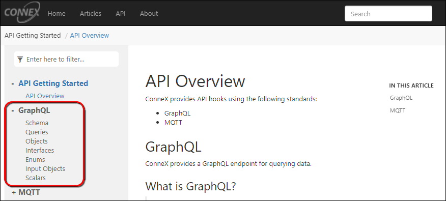
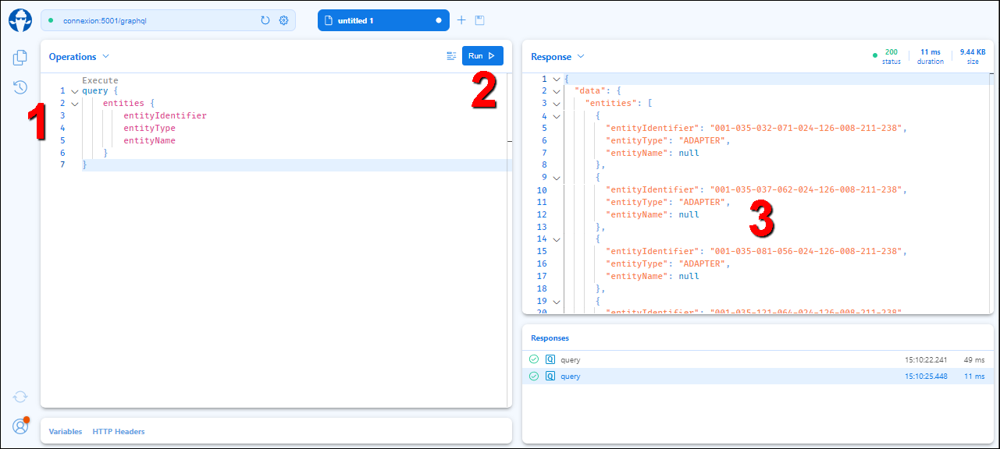
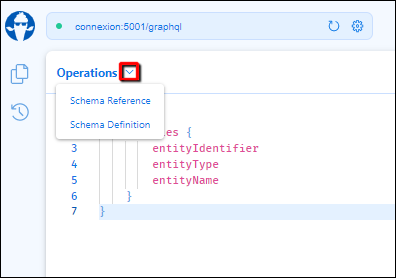
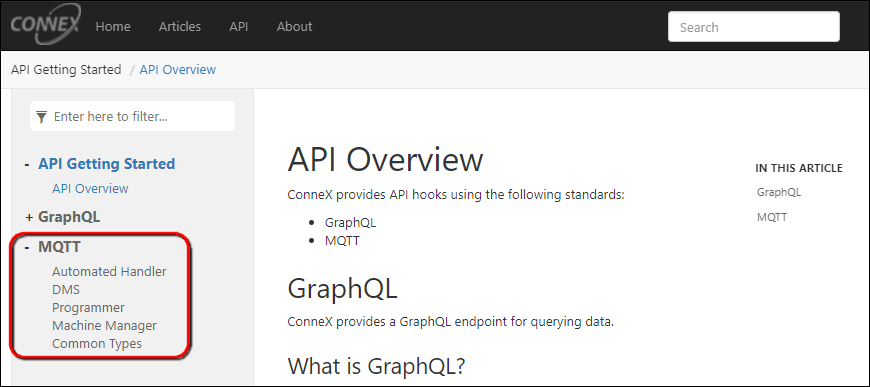
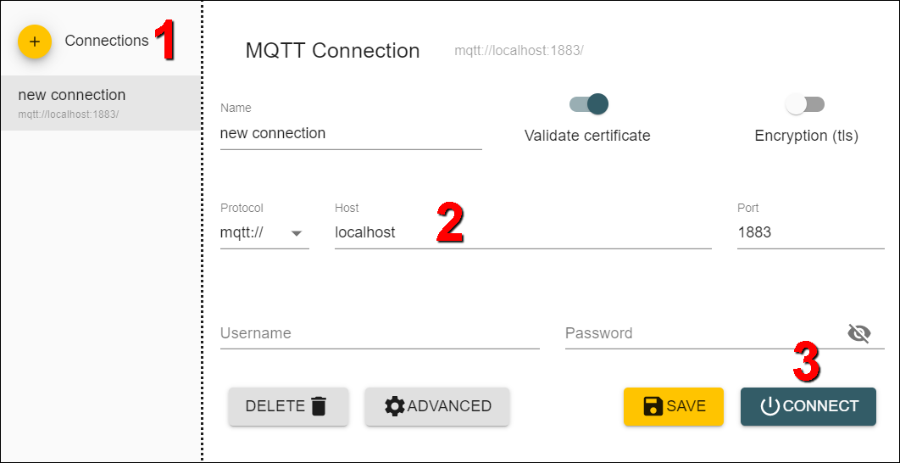
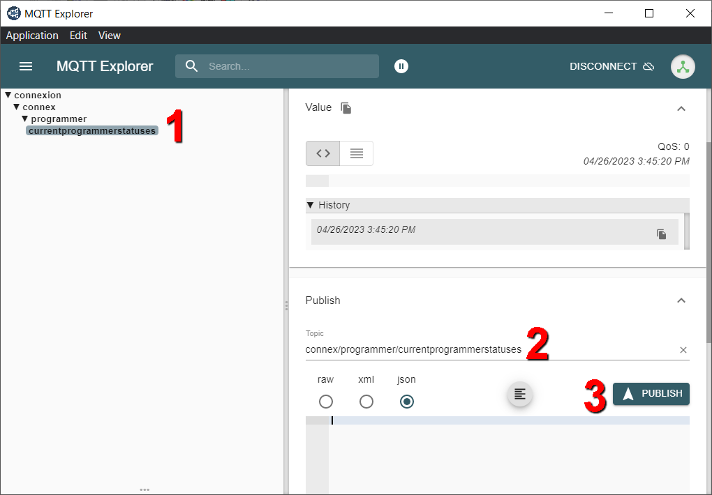

# API Overview
ConneX provides API hooks using the following standards:

* GraphQL
* MQTT

## GraphQL
ConneX provides a GraphQL endpoint for querying data.

### What is GraphQL?

> GraphQL is a query language for APIs and a runtime for fulfilling those queries with your existing data. GraphQL provides a complete and understandable description of the data in your API, gives clients the power to ask for exactly what they need and nothing more, makes it easier to evolve APIs over time, and enables powerful developer tools.

Source: https://graphql.org/

To get started with GraphQL in ConneX, expand **GraphQL** (in the left navigation pane) and review the available types of data fields you can retrieve from the GraphQL API in ConneX. Then create a list of desired fields and begin to construct queries to retrieve them from ConneX.

To test your GraphQL queries:
1.	On the ConneX Server, open a browser window to http://localhost:5001/graphql.
2.	Paste your query in the left pane, and then click **Run**.
3.	Review the query results/output in the right pane. For example:
 

4.	For help on modifying your queries, click the **Operations** drop-down arrow (near the top-left corner) to access the Schema Reference and Definition.
 

5.	Similarly, click the **Response** drop-down arrow (in the right pane) for more information about how ConneX processed the query.
 

After crafting and perfecting your queries as desired, paste them into your manufacturing execution system (MES) or other application (ex. a reporting/data analytics computer that sends GraphQL queries). Then test the queries again.

## MQTT
ConneX provides an MQTT broker that your MES (or other data processing application) can subscribe to.

### What is MQTT?

> **MQTT** is a lightweight, publish-subscribe network protocol that transports messages between devices. The protocol usually runs over TCP/IP, however, any network protocol that provides ordered, lossless, bi-directional connections can support MQTT. It is designed for connections with remote locations where a resource constraints exist or the network bandwidth is limited. The protocol is an open OASIS standard and an ISO recommendation (ISO/IEC 20922).

Source: https://en.wikipedia.org/wiki/MQTT

To get started with MQTT in ConneX, expand **MQTT** (in the left navigation pane) and review the available types of event notifications to which you can subscribe from the MQTT API in ConneX. Then create a list of desired events and begin to construct queries to receive them from ConneX.

To test your MQTT queries:
1.	Install MQTT Explorer from http://mqtt-explorer.com/.
2.	Start MQTT Explorer.
3.  Add a new connection by specifying the appropriate host settings (default is **mqtt://localhost:1883**), then click **Connect**. For example:
 

3.	In the left pane treeview, navigate to the desired event.
4.	In the right pane, scroll down to the **Publish** section, and confirm/modify the event query in the **Topic** box. For example:
 

5.	Select a desired output format (raw, xml, or json) and click **Publish** to run the event query.
6.	Review the query results/output in the right pane.

After crafting and perfecting your queries as desired, paste them into your manufacturing execution system (MES) or other application (ex. an IT/Ops/Systems Management computer that subscribes to MQTT event messages). Then test the queries again.

For testing purposes only, consider installing MQTT Explorer on your production ConneX Server. Then as you run a test batch/job, MQTT Explorer reveals the events published by ConneX service, Machine Manager, AH/CH700, LumenX DMS, and programmer(s). You can un-install MQTT Explorer after confirming that your MQTT queries are capturing the appropriate and expected test jobs data.

